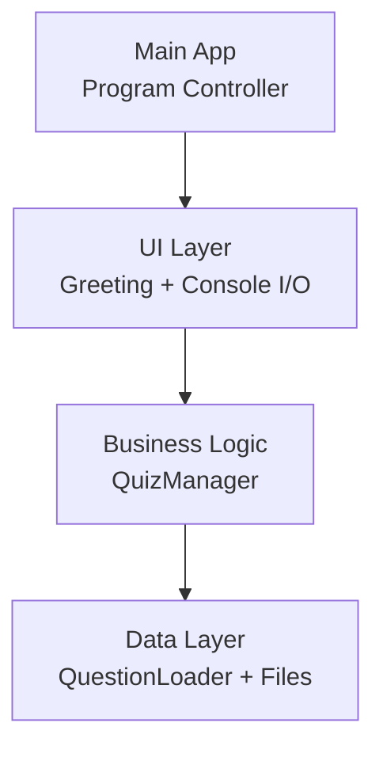
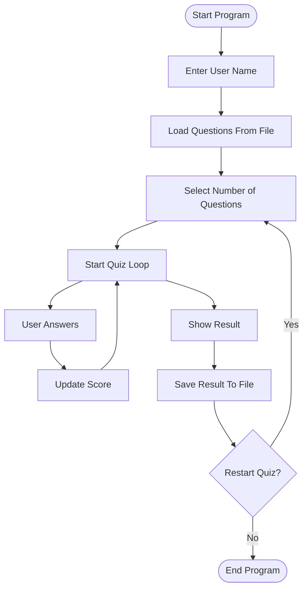
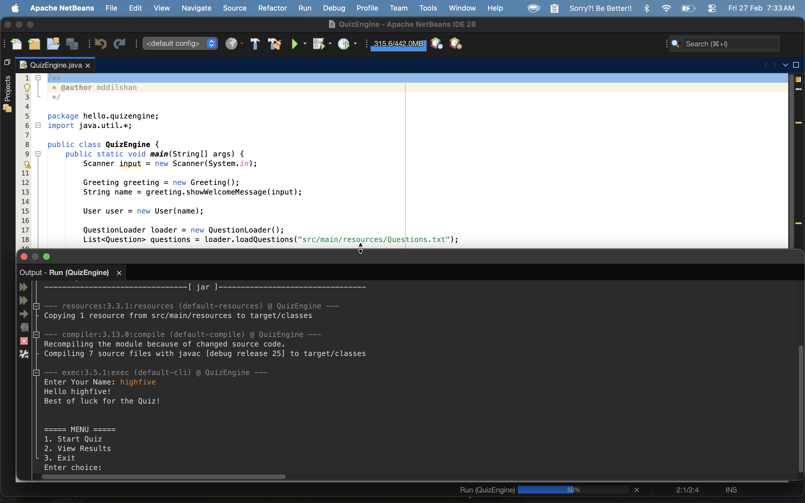
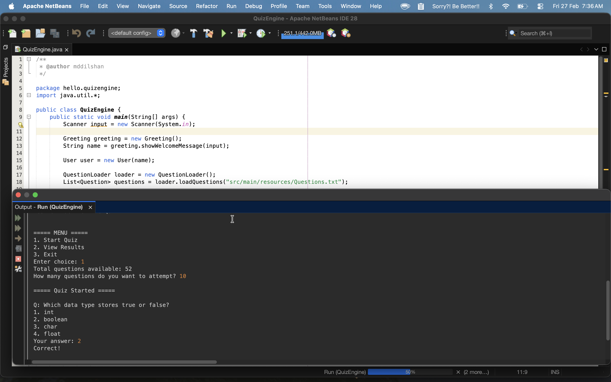
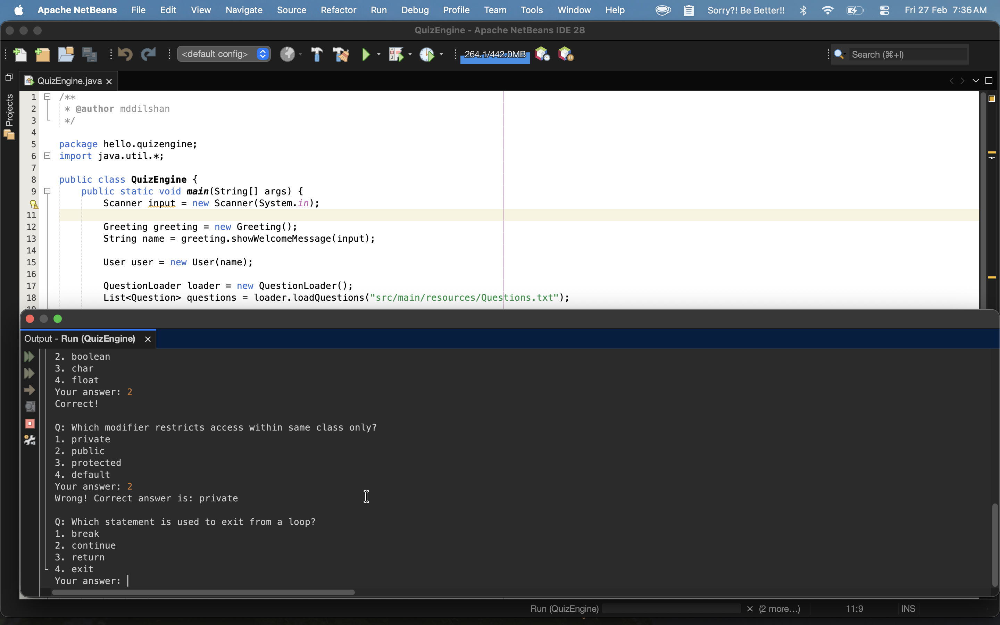
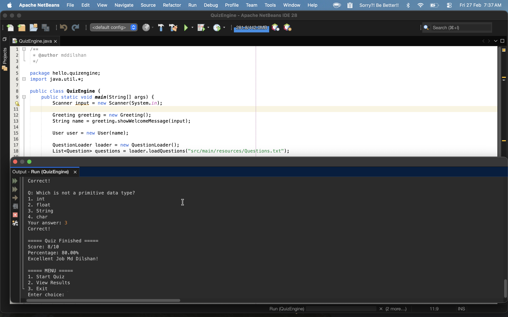
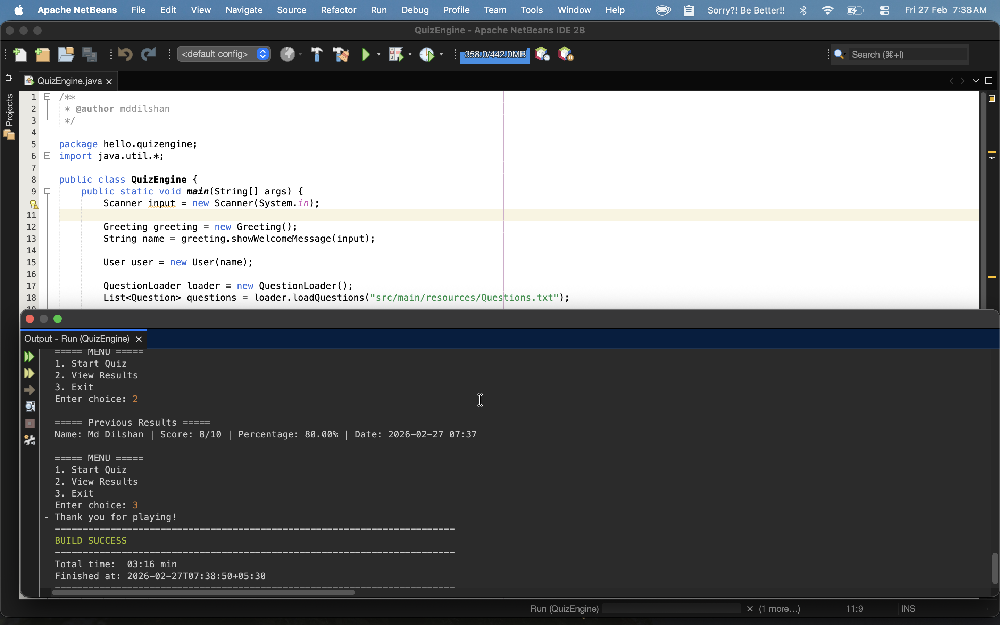

# 🧠 JavaQuizEngine

A modular **console-based quiz application** built using core **Object-Oriented Programming (OOP)** principles in Java.  
The project demonstrates clean architecture, file-based question loading, scoring logic, and persistent result storage.

Designed as part of my Java learning journey to strengthen fundamentals such as classes, collections, file handling, and modular design.

---

## 🚀 Features

- 📂 Load questions from external file
- 🎲 Randomized question order
- 🎯 User-selected number of questions
- 🧮 Automatic score and percentage calculation
- 💾 Result saving to file
- 📜 View previous results
- 🔁 Restart quiz option
- 🏗️ Modular architecture (separate classes)

---

## 🏛️ System Architecture



---

## 🔄 Application Flow



---

## 📁 Project Structure

```
QuizEngine
│── src
│   └── main
│       ├── java
│       │   └── hello.quizengine
│       │       ├── QuizEngine.java
│       │       ├── QuizManager.java
│       │       ├── Question.java
│       │       ├── QuestionLoader.java
│       │       ├── Greeting.java
│       │       ├── User.java
│       │       └── ResultSaver.java
│       └── resources
│           └── Questions.txt
│
├── pom.xml
└── README.md
```

---

## ▶️ How to Run

### Using Maven

```bash
mvn compile
mvn exec:java -Dexec.mainClass="hello.quizengine.QuizEngine"
```

### Using IDE

1. Open project in NetBeans / IntelliJ
2. Run `QuizEngine.java`

---

## 📝 Question File Format

Example `Questions.txt`:

```
What is OOP?
Object Oriented Programming
Operating System Process
Order of Processing
None
1

What is JVM?
Java Virtual Machine
Java Vendor Machine
Just Virtual Memory
None
1
```

Format:

```
Question
Option 1
Option 2
Option 3
Option 4
Correct Option Number
(blank line)
```

---

## 💾 Result Storage

Results are saved automatically to:

```
results.txt
```

Example:

```
Name: Dilshan | Score: 4/5 | Percentage: 80.00% | Date: 2026-02-27 06:10
```

---

## 🛣️ Future Improvements

Planned enhancements:

- ⏱️ Timer per question
- 🖥️ GUI version (Swing / JavaFX)
- 🗄️ PostgreSQL database integration
- 👨‍💼 Admin panel for question management
- 🏆 Leaderboard system
- 🌐 REST API version (long term)

---

## 🎯 Learning Goals

This project helped me practice:

- Object-Oriented Programming
- Java Collections
- File Handling
- Modular Design
- Git & GitHub workflow
- Maven project structure

---

## 📸 Screenshots

<p align="center">
  
  
  
  
  
</p>

---

## 📜 License
This project is licensed under the MIT License — see the LICENSE file for details.
---

## ⭐ Author

**Md Dilshan**

If you found this project useful, consider giving it a ⭐ on GitHub!
