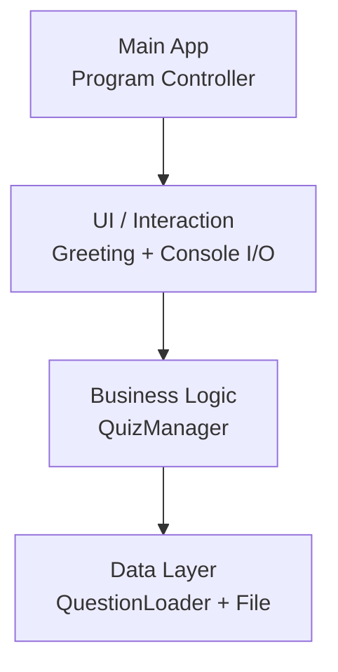
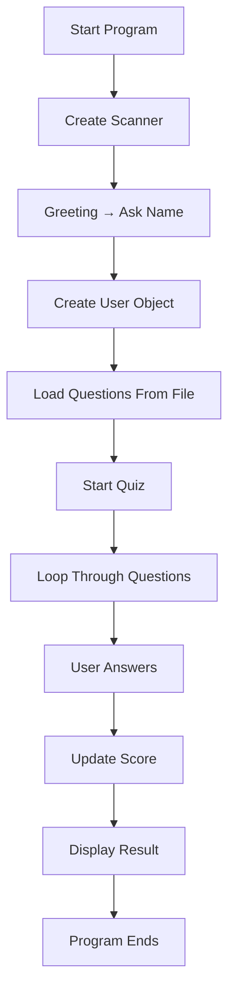
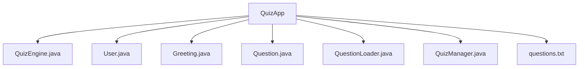

# 🧠 JavaQuizEngine

A Java-based quiz application built using core Object-Oriented Programming (OOP) concepts.
The project demonstrates modular architecture, file-based question loading, and interactive console gameplay.

Designed as part of my Java learning journey to strengthen fundamentals like classes, constructors, collections, and file handling.

---


## ✨ Features
- 👤 User registration with personalized greeting
- ❓ Dynamic quiz questions loaded from file
-	🧮 Score calculation system
-	📊 Performance feedback based on score
-	📂 Modular and scalable architecture
-	🔄 Easy to update questions without changing code
-	🧱 Clean separation of concerns (UI, Logic, Data)
  
---

## 🏗️ System Architecture


``` mermaid
flowchart TD
    A[Main App<br> Program Controller ]
    B[UI / Interaction<br>Greeting + Console I/O]
    C[Business Logic<br>QuizManager]
    D[Data Layer<br>QuestionLoader + File]

    A --> B
    B --> C
    C --> D
```

### Explanation
-	**Main App** → Controls overall program flow
-	**UI Layer** → Handles user interaction and input
-	**Business Logic** → Core quiz functionality and scoring
-	**Data Layer** → Loads questions from external file

---

## 🔄 Program Execution Flow


``` mermaid
flowchart TD
    A[Start Program]
    B[Create Scanner]
    C[Greeting → Ask Name]
    D[Create User Object]
    E[Load Questions From File]
    F[Start Quiz]
    G[Loop Through Questions]
    H[User Answers]
    I[Update Score]
    J[Display Result]
    K[Program Ends]

    A --> B --> C --> D --> E --> F --> G --> H --> I --> J --> K

```

---

## 🧩 Class Responsibilities

### 👤 User
Stores User information.
-	name
- score

---

### 👋 Greeting
Handles welcome interaction.
- Ask username
- Display greeting message

---

### ❓ Question

Represents a single quiz question.
- question text
- options
- correct answer

---

### 📂 QuestionLoader
Loads questions from external file.
- Reads file
- Parses data
- Creates Question objects

---

### 🧠 QuizManager

Core logic of the system.
- Displays questions
- Accepts answers
- Validates responses
- Updates score
- Controls quiz flow

---

### 🚀 Main (QuizEngine)
Program entry point.
- Creates objects
- Connects modules
- Starts quiz

---

### 📁 Project Structure


```mermaid
flowchart TD
    A[QuizApp]
    B[QuizEngine.java]
    C[User.java]
    D[Greeting.java]
    E[Question.java]
    F[QuestionLoader.java]
    G[QuizManager.java]
    H[questions.txt]

    A --> B
    A --> C
    A --> D
    A --> E
    A --> F
    A --> G
    A --> H
```

---

### 📄 Questions File Format

Example `questions.txt`:

```
What is Java?
Programming Language
Animal
Car
City
1

What is OOP?
Encapsulation
Inheritance
Polymorphism
All of the above
4
```

Structure:
```
Question
Option 1
Option 2
Option 3
Option 4
Correct Answer Number
(blank line)
```

---

## ▶️ How to Run

### Compile

```
javac *.java
```

### Run
```
java QuizEngine
```

---

## 🚀 Future Improvements

- GUI version using Swing or JavaFX
- Timer for each question
- Difficulty levels
- Leaderboard system
- Database integration
- Admin panel for adding questions
- Randomized question order

---

## 🎯 Learning Outcomes

This project helped me understand:
- Object-Oriented Programming (OOP)
- Constructors and classes
- Arrays and collections
- File handling in Java
- Modular software design
- Separation of concerns
- Program architecture design

---

## 📌 Author

Developed as part of my journey to learn Java and software design principles.

---

⭐ If you found this project helpful, feel free to star the repository!
